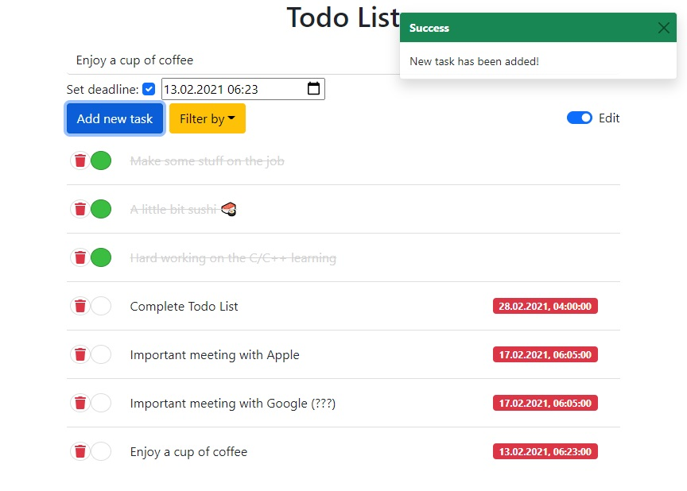
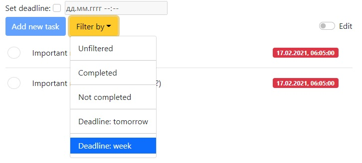
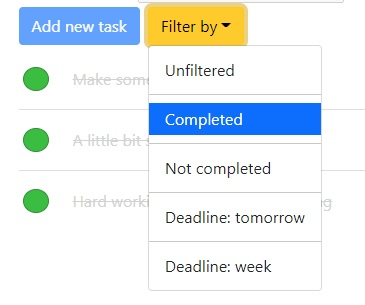
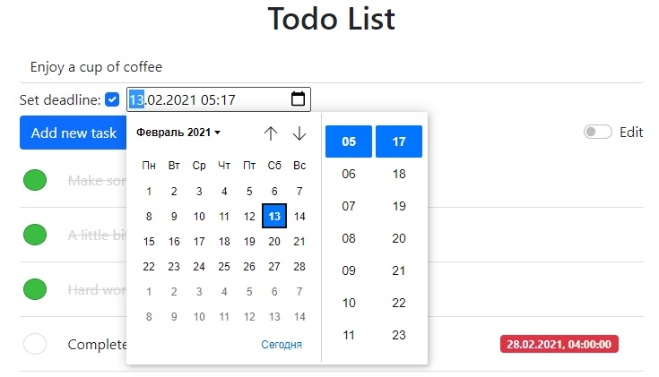
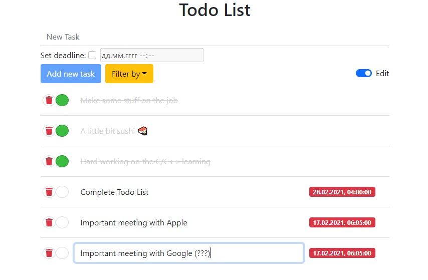
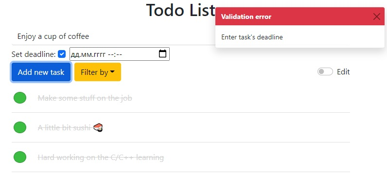

# Homework #3 TODO list
## Deadline: 23/01
## Задание
Необходимо написать todo list, стилевое оформление не важно, можно сделать по минимуму или по наличию времени
#### на "3":
1. Никакого es6
1. Можно добавлять/удалять задачи из списка
1. Можно пометить выполнена/не выполнена задача из списка
#### на "4":
1. Выполнены все ребовани на "3"
1. При добавлении задачи можно устанавливать дедлайн на ее выполнение
1. Можно фильтровать отображаемые задачи по: 1) сделано/не сделано 2) по дедлайну: завтра, неделя
#### на "5":
1. Выполнены все требования на "3" и "4"
1. Использовать паттерн "модуль"
1. на 5 с +: при обновлении страницы в браузере, добавленные таски в списке и вся информация о них должна оставаться

# Results

## Filtering:
- by completed/not completed, by day, by week

## Add new tasks:
- also with setting deadline

## Edit mode:
- with task renaming & removal & changing their status to completed/not completed

## Interactive toasts:
- when successful creating of the task
- or with  some errors

